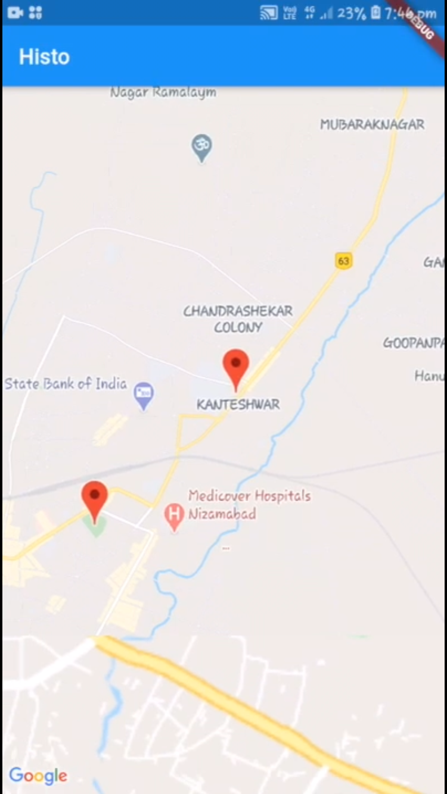
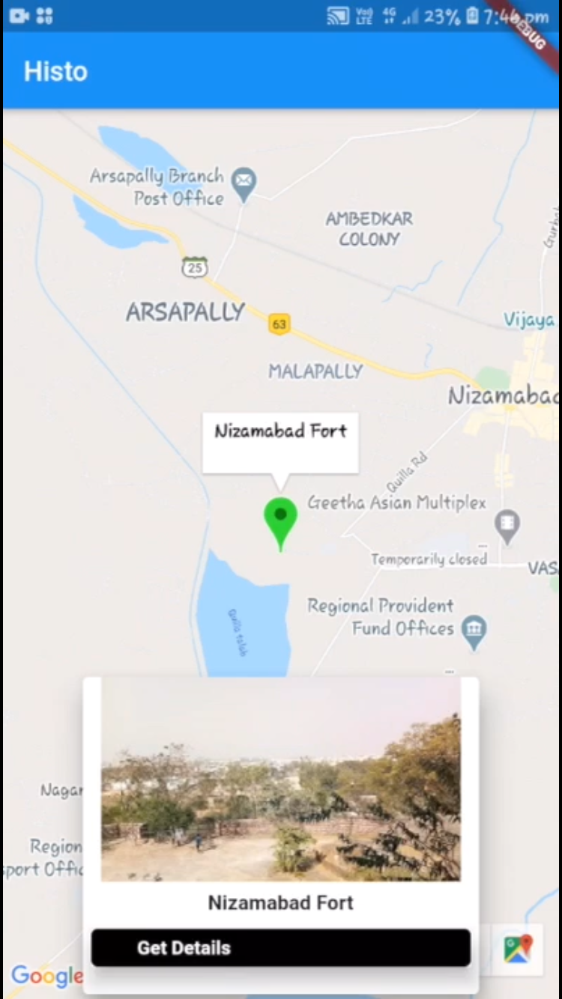

# Histo

## An app that let you know Historical Information of nearby places.

## Introduction

Now a days, many people wants to visit all the places around them and they show almost interest in seeing the beauty behind all the places as well as know the information regarding the place. Not all the places on earth have tourist guides to guide the tourists. So tourist who visit the place may or may not have a tourist guide with them who can tell the information about the place they visit. So if the tourist don’t come across any tourist guide, they can’t know the history about the place. So we are here to present you Histo, a place where you find all the information regarding the place you are at that particular location. These days many websites and apps that help you out with different tasks. So we came up with app that let you know the historical information regarding that place. This app shows all the places around you and includes an option to show you the directions to the place.

A few resources to get you started if this is your first Flutter project:

- [Lab: Write your first Flutter app](https://flutter.io/docs/get-started/codelab)
- [Cookbook: Useful Flutter samples](https://flutter.io/docs/cookbook)

For help getting started with Flutter, view  
[online documentation](https://flutter.io/docs), which offers tutorials, 
samples, guidance on mobile development, and a full API reference.

<H2>Features</H2>

<H2>Api Used<H2>

- [Location : To get current location of the user](https://pub.dartlang.org/packages/location)  
- [Google Maps : To integerate google maps](https://pub.dartlang.org/packages/google_maps_flutter)
- [Google Maps Webservices : To get nearby shops](https://pub.dartlang.org/packages/google_maps_webservice)
- [Url Launcher](https://pub.dartlang.org/packages/url_launcher)
- [Youtube API](https://pub.dev/packages/youtube_player_flutter)

<H2>Images<H2>

